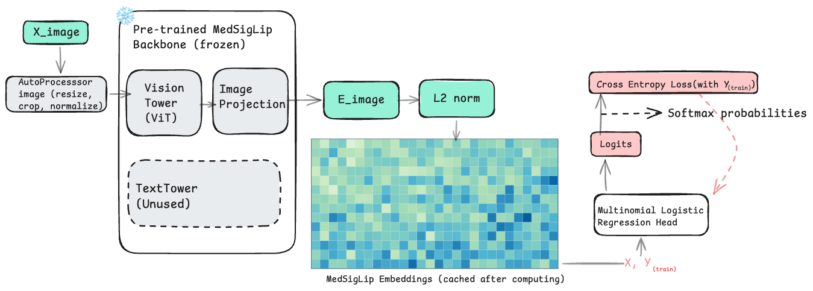
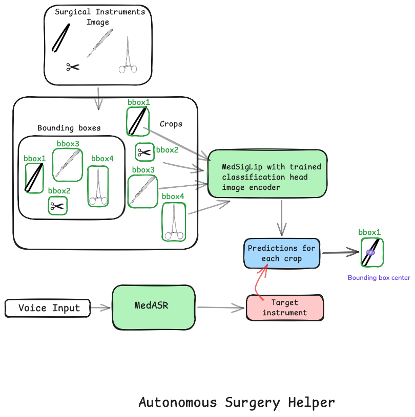

# haloOR Surgical Tool Pipeline

End-to-end pipeline for audio-guided surgical instrument localization.

Given an input image (or image folder) and an optional audio request, the pipeline:
1. transcribes audio and extracts target instrument label,
2. detects candidate instruments with classical CV,
3. classifies each crop with MedSigLIP embeddings + saved classifier head,
4. returns merged predictions and the first bbox matching the audio target.

## Repository Layout

```text
.
├── assets/
│   ├── notes/
│   └── samples/
│       ├── audio/
│       └── images/
├── docs/
│   ├── images/
│   │   ├── arch.png
│   │   └── flow.png
│   ├── model_build.md
│   └── RUN_INSTRUCTIONS.md
├── scripts/
│   ├── RUN_COMMANDS.sh
│   └── RUN_COMMANDS_WITH_HF_TOKEN.sh
├── surgical_tool_pipeline/
│   ├── __init__.py
│   ├── api.py
│   ├── audio.py
│   ├── audio_instrument/
│   │   ├── asr.py
│   │   ├── extract.py
│   │   └── utils.py
│   ├── bboxsi_main.py
│   ├── classifier.py
│   ├── cli.py
│   ├── config.py
│   ├── detector.py
│   ├── helpers.py
│   ├── medsiglip_infer.py
│   ├── pipeline.py
│   ├── robot.py
│   └── models/
│       └── best_model/
└── requirements-combined.txt
```

## Architecture

```text
Audio (optional) -> audio_instrument/asr.py -> audio_instrument/extract.py
                                                             |
Image path -> robot.py (optional) -> detector.py -> classifier.py
                                             \               /
                                              \             /
                                               pipeline.py (merge + first matching bbox)
```

## Architecture Diagram



This diagram shows module-level responsibilities and how audio/image paths converge into the final report.

## End-to-End Flowchart



This flowchart shows the runtime sequence from request inputs to written output artifacts.

## Classification Model Build Details

The bundled classifier is a fixed artifact loaded from:
- `surgical_tool_pipeline/models/best_model/model.joblib`
- `surgical_tool_pipeline/models/best_model/config.json`
- `surgical_tool_pipeline/models/best_model/label_mapping.json`
- `surgical_tool_pipeline/models/best_model/candidate_results.json`

### Build metadata (from `config.json`)

- Build timestamp (UTC): `2026-02-18T05:04:07.188196+00:00`
- Embedding backbone: `google/medsiglip-448`
- Dataset path recorded in artifact: `surgical tools`
- Embedding normalization: `l2norm`
- Random seed: `42`
- Selected best head: `logreg_C=1.0` (multinomial logistic regression)

### Label space (from `label_mapping.json`)

- `0 -> forceps`
- `1 -> hemostat`
- `2 -> scalpel`
- `3 -> scissors`

### Candidate heads evaluated (from `candidate_results.json`)

Multiple heads were benchmarked on the same embedding set, including:
- Logistic regression with multiple `C` values
- Calibrated linear SVM with multiple `C` values
- MLP heads with different hidden sizes and regularization

Best selected head in artifact:
- Name: `logreg_C=1.0`
- Type: `logreg`
- Hyperparameters: `C=1.0`, `solver=lbfgs`, `multi_class=multinomial`
- Validation accuracy: `0.99609375`
- Validation macro-F1: `0.9960935115668681`

### How runtime classification works in this repo

1. Each crop is converted to MedSigLIP embedding via `AutoImageProcessor` + `AutoModel`.
2. Embeddings are fed into the saved scikit-learn head (`model.joblib`).
3. Probabilities are produced with `predict_proba` (or decision-function fallback).
4. Optional `--candidate_labels` filtering renormalizes probabilities over the allowed subset.
5. Predictions are attached to each bbox and exported in merged JSON/CSV reports.

For full rebuild details and artifact schema, see:
- `docs/model_build.md`

## Supported Labels

Canonical labels used by the pipeline:
- `forceps`
- `hemostat`
- `scissors`
- `scalpel`
- `unknown` (audio extraction fallback)

Audio tie-break priority when multiple labels appear:
- `forceps > hemostat > scissors > scalpel`

## Prerequisites

- Python 3.10+
- Linux/macOS shell (commands below use `bash`)
- Optional CUDA environment for GPU acceleration
- Optional Hugging Face token for gated model access

## Setup

From the parent directory that contains `haloOR/`, enter the repo first:

```bash
cd haloOR
python3 -m venv .venv
source .venv/bin/activate
python -m pip install --upgrade pip setuptools wheel
python -m pip install -r requirements-combined.txt
```

If you are already inside `haloOR/`, skip `cd haloOR`.

## Hugging Face Authentication (Optional but commonly needed)

Default model IDs are:
- Image backbone: `google/medsiglip-448`
- Audio ASR: `google/medasr`

If your account requires auth:

```bash
export HF_TOKEN="hf_xxx_your_token_here"
python -c "import os; from huggingface_hub import whoami; print(whoami(token=os.environ['HF_TOKEN']))"
```

Recognized env vars in code:
- `HF_TOKEN`
- `HUGGINGFACE_HUB_TOKEN`
- `HUGGING_FACE_HUB_TOKEN`

First-time runs also require network access to download model files from Hugging Face.

## Run Commands

All commands below assume your current working directory is `haloOR/`.

### 1) Image-only pipeline

```bash
python -m surgical_tool_pipeline.cli \
  --input assets/samples/images/image1.jpg \
  --output_dir pipeline_outputs \
  --device auto
```

### 2) Audio-guided pipeline

```bash
python -m surgical_tool_pipeline.cli \
  --input assets/samples/images/image1.jpg \
  --audio_input assets/samples/audio/new.wav \
  --audio_device auto \
  --device auto \
  --output_dir pipeline_outputs
```

### 3) Folder input (recursive)

```bash
python -m surgical_tool_pipeline.cli \
  --input /path/to/image_folder \
  --recursive \
  --output_dir pipeline_outputs
```

### 4) Restrict classifier labels

```bash
python -m surgical_tool_pipeline.cli \
  --input /path/to/image.jpg \
  --candidate_labels forceps scissors
```

### 5) Robot API mode

```bash
python -m surgical_tool_pipeline.cli \
  --robot \
  --robot_api_url http://localhost:8000/get_image_path \
  --robot_api_method POST \
  --robot_payload_json '{"case_id": 101}' \
  --input /optional/fallback/path.jpg \
  --output_dir pipeline_outputs
```

### 6) Standalone detector (classical CV only)

```bash
python -m surgical_tool_pipeline.bboxsi_main \
  --input_dir assets/samples/images \
  --output_dir bbox_outputs \
  --recursive
```

### 7) Standalone classifier inference on folder

```bash
python -m surgical_tool_pipeline.medsiglip_infer \
  --model_dir surgical_tool_pipeline/models/best_model \
  --input_folder assets/samples/images \
  --output_csv outputs/reports/preds_from_input.csv \
  --device auto
```

### 8) Helper scripts

```bash
bash scripts/RUN_COMMANDS.sh
bash scripts/RUN_COMMANDS_WITH_HF_TOKEN.sh
```

## Programmatic API

```python
from surgical_tool_pipeline import run_pipeline_in_memory

result = run_pipeline_in_memory(
    input_path="assets/samples/images/image1.jpg",
    audio_input_path="assets/samples/audio/new.wav",
    output_dir="pipeline_outputs",
    device="auto",
    audio_device="auto",
)

print(result["audio_target_instrument"])
print(result["first_audio_matched_bbox"])
```

API adapter for request payloads:
- `surgical_tool_pipeline.api.run_pipeline_api_entrypoint(request_obj)`

## Output Artifacts

All outputs are placed under `--output_dir` (default: `pipeline_outputs`):

- `json/`:
  - Per-image detector/classifier records
- `vis/`:
  - Visualization images with bbox overlays
- `crops/`:
  - Per-bbox crop images
- `reports/merged_bbox_predictions.json`:
  - Full merged run output
- `reports/merged_bbox_predictions.csv`:
  - Flat tabular summary
- `reports/first_audio_matched_bbox.json`:
  - Present only when audio-guided match is found
- `masks/`:
  - Present only with `--save_masks`

## Important CLI Flags

- Input/output:
  - `--input`, `--output_dir`, `--recursive`, `--extensions`, `--save_masks`, `--crop_pad`
- Classifier:
  - `--model_dir`, `--model_id_override`, `--device`, `--batch_size`, `--num_workers`, `--no_amp`, `--candidate_labels`
- Audio:
  - `--audio_input`, `--audio_device`, `--audio_model_id`, `--audio_chunk_length_s`, `--audio_stride_length_s`
- Robot API:
  - `--robot`, `--robot_api_url`, `--robot_api_method`, `--robot_timeout_sec`, `--robot_payload_json`, `--robot_response_image_key`, `--robot_response_image_list_key`
- Detector tuning:
  - `--v_dark`, `--roi_close_k`, `--roi_open_k`, `--delta_v`, `--s_min`, `--obj_close_k`, `--obj_open_k`, `--min_area`, `--max_area_frac`, `--max_aspect`, `--split_merged`, `--split_erode_max_iter`, `--auto_thresholds`

## Troubleshooting

- `401 Unauthorized` from Hugging Face:
  - Verify `HF_TOKEN` is exported in the same shell.
  - Confirm model access for your HF account.
- `Failed to load MedSigLIP backbone` with connection/DNS errors:
  - Ensure internet access to `huggingface.co`.
  - Retry after exporting `HF_TOKEN` if the model repo is gated for your account.
- `No matching images found`:
  - Verify `--input` path and extension filters.
- `first_audio_matched_bbox` is `null`:
  - Audio target may be `unknown`, or no detection predicted the same class.
- `CUDA requested but not available`:
  - Use `--device cpu` and/or `--audio_device cpu`.
